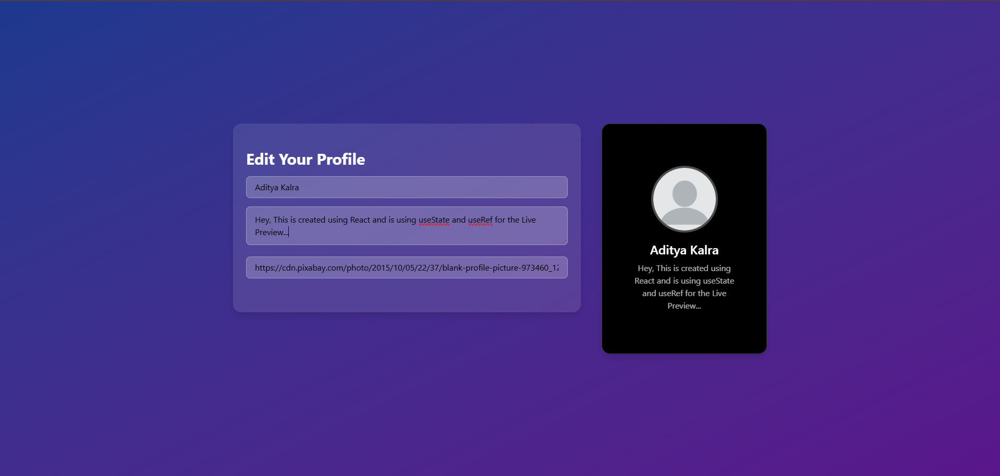

# Profile Card Editor

 Using the Concept of Atomic Design I have created Profile Editor that uses in-built Hooks 

---

## Demo / Preview

<!-- Add a screenshot, video, or link to live demo -->
  

---

## Features

- Uses Atomic Design Architecture
- Live Preview

---

## Tech Stack

**Client:** React / Tailwindcss
---

### Prerequisites

- Node.js / 

# Demo Image Url - 
   https://cdn.pixabay.com/photo/2015/10/05/22/37/blank-profile-picture-973460_1280.png 
   Consider that you want to test it just copy paste the url